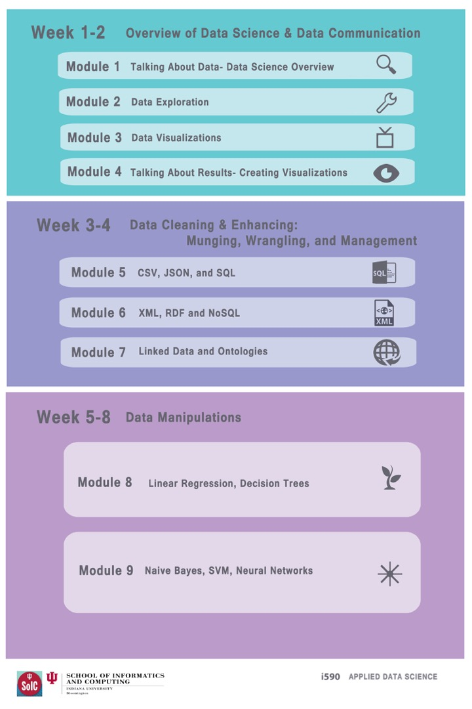
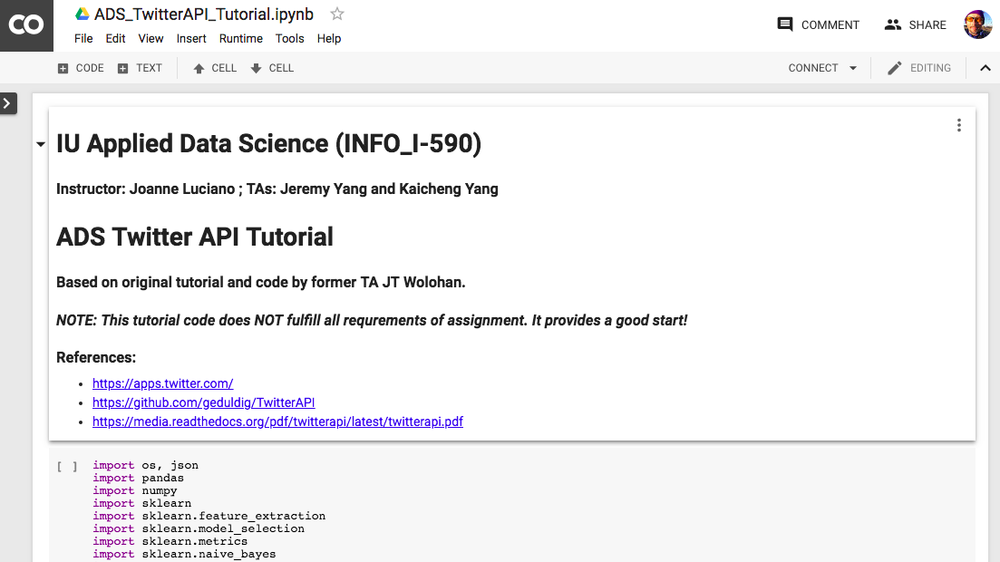
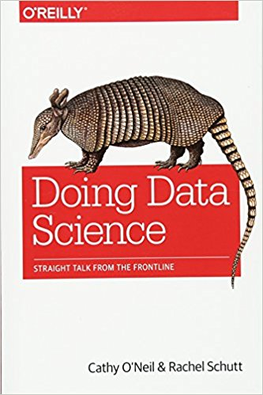
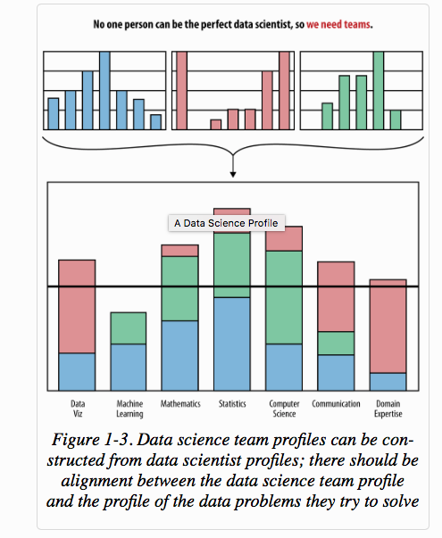
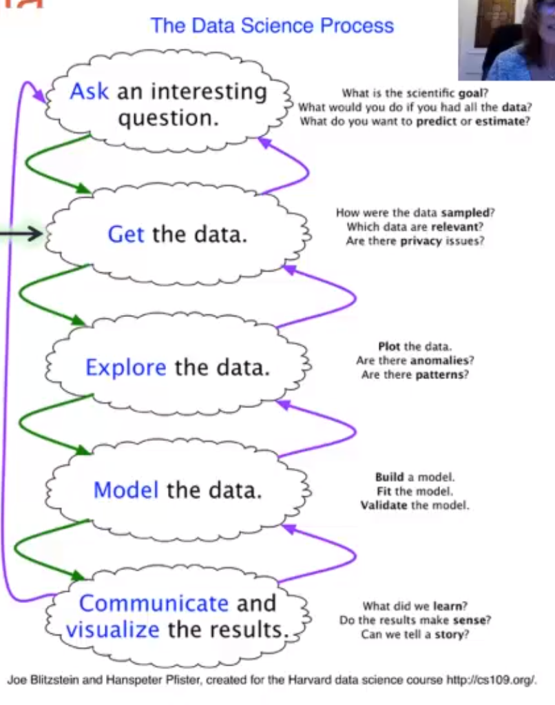
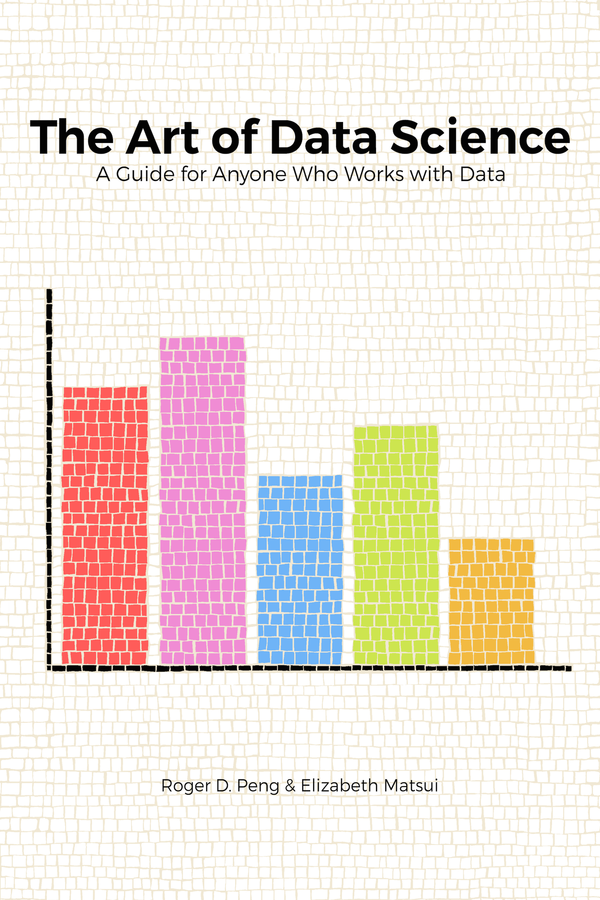
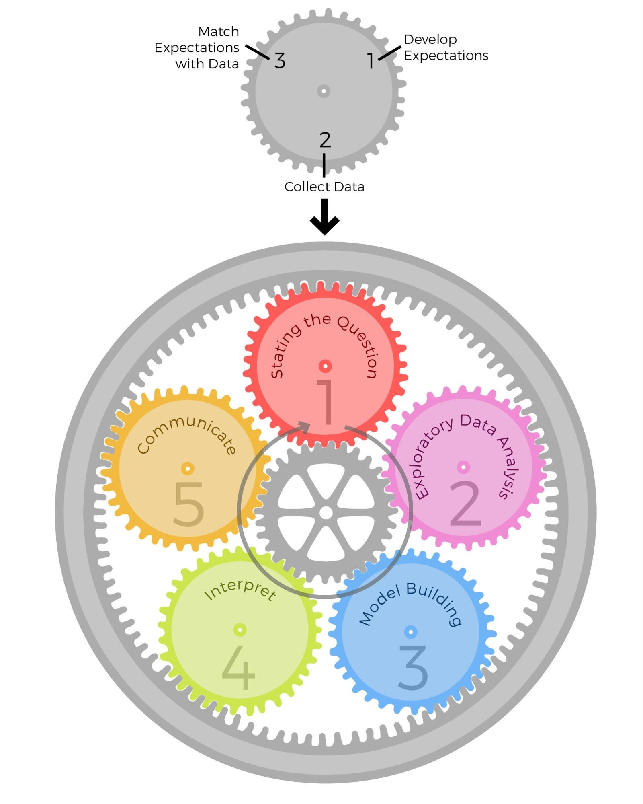

# Applied Data Science (ADS)

Applied Data Science (ADS, INFO_I-590, "Topics in Informatics") is an online course first
developed by Prof Joanne Luciano and Associate Instructor JT Wolohan and offered in the
spring of 2017.  ADS was organized around the idealized "classic data science workflow"
with emphasis on the real world variability of data science applications, and how
appropriate methods and tools should be applied for a given scenario.  Tutorials on skills
and tools are included (R and Python) but the emphasis is on the application of skills and
tools to realistic problems.  For the spring 2018 edition of the course, Jeremy Yang
joined Kaicheng Yang as AIs for the course.  Jeremy was tasked with reviewing the course
and recommending and implementing revisions to improve coherence and consistency.  Much
excellent content was not contextualized sufficiently for some students, who were unclear
as to the difference between computational virtuosity and the broader needs of data
science.  In addition, some updating of the computational and instructional methodology
was justified, for example replacing command-line Python with Jupyter notebooks, and
replacing R-Commander with R-Studio.  Informed by discussions with Joanne and Kaicheng,
Jeremy revised the third unit on machine learning algorithms, slightly reducing the number
of algorithms covered, but enhancing the contextualization, the understanding of how to
select appropriate algorithm classes for given scenarios.  Additionally, the "Final
Exercise" was revised, to three options: (1) the Kaggle challenge previously required, for
advanced students, (2) a Twitter API sentiment analysis problem formerly required in module 9,
and (3) a option for an original student proposal.  These options enable educational
advantages for a range of student profiles.

ADS Overview Diagram:

> 

Jupyter notebook developed for a video tutorial on the Twitter API final exercise option:

> 

Another addition was to recommend as an accompanying textbook "Doing Data Science" by
Cathy O'Neill and Rachel Schutt, which aligns well with the theme and content of ADS.
Another addition was a short enriching video lecture "Why Data Scientists Like Models"
describing the various important meanings of models and modeling.

> 

Some diagrams and resources related to the workflows of data science:

|  |  |
|:---:|:---:|
| Data science teams and roles | Data science flowchart |
|  |   |
| Art of Data Science book | Roger Peng's Data Science Epicycles diagram  |
